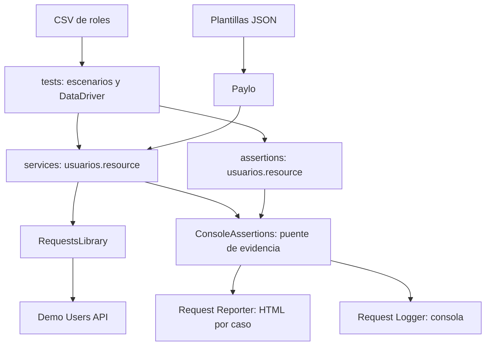
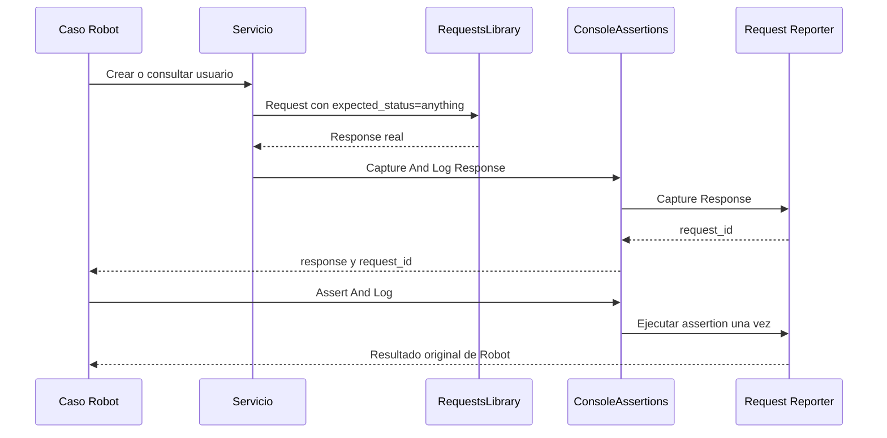
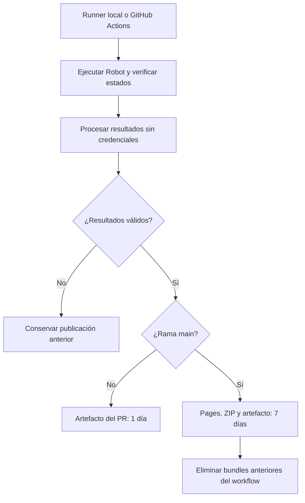

# Arquitectura del ejemplo de APIs

El proyecto separa el escenario de negocio, las llamadas HTTP y las comprobaciones. Las librerías de reporting y consola se consumen como dependencias: no se copia su implementación al ejemplo.

## Dependencias de ejecución

| Pieza | Responsabilidad |
| --- | --- |
| `tests/usuarios.robot` | CRUD, conflictos, ciclo de vida, filtros, validaciones negativas y autenticación. |
| `tests/usuarios_ddt.robot`, `data/usuarios.csv` | Ejecutar el mismo negocio con diferentes roles. |
| `data/payloads/`, Paylo | Preparar JSON conservando tipos; no ejecutar peticiones. |
| `resources/services/usuarios.resource` | Enviar HTTP, capturar la response y limpiar los usuarios creados. |
| `resources/assertions/usuarios.resource` | Comprobar códigos HTTP y valores de negocio. |
| `resources/assertions/ConsoleAssertions.py` | Asociar los IDs de Reporter y Logger; una response y una ejecución de la assertion alimentan ambos. |
| `resources/config/http.resource` | Base URL, timeout, credencial y modo de consola. |
| `scripts/run_demo.py` | Preparar la ejecución, verificar los resultados esperados y procesar los archivos antes de publicarlos. |

## De una petición a su evidencia

El puente también registra la misma response y el resultado en Request Logger. `expected_status=anything` permite comprobar un 401, 409 o 422 en la assertion de negocio. Un HTTP 200 no convierte una assertion fallida en PASS.

## Preparación, limpieza y publicación

1. Suite Setup consulta `/health` y espera disponibilidad.
2. Test Setup prepara datos ficticios y correo único.
3. Cada test crea los usuarios que necesita y almacena sus IDs.
4. Test Teardown elimina los usuarios creados, también después de una assertion fallida.
5. El runner verifica los estados esperados: ocho PASS, un FAIL intencional y un SKIP.
6. Procesa todos los resultados y elimina la credencial de los archivos destinados a publicación.

Pages y su ZIP permanecen hasta una nueva publicación válida. Los siete días corresponden al artefacto de Actions. Los reportes no se guardan en Git. El modo `--local` usa el proyecto FastAPI independiente; no sustituye la API con respuestas simuladas.

## Contrato de la API

Consulta [los modelos de OpenAPI](https://angel-valdezzz.github.io/demo-users-api/): requests y responses reutilizan schemas definidos por Pydantic. La estructura describe tipos y restricciones; las assertions de este ejemplo comprueban además el comportamiento de negocio. Para validar el contrato completo desde pruebas, usa el documento OpenAPI correspondiente a la versión del servicio y evita mantener una segunda copia manual de sus modelos.
